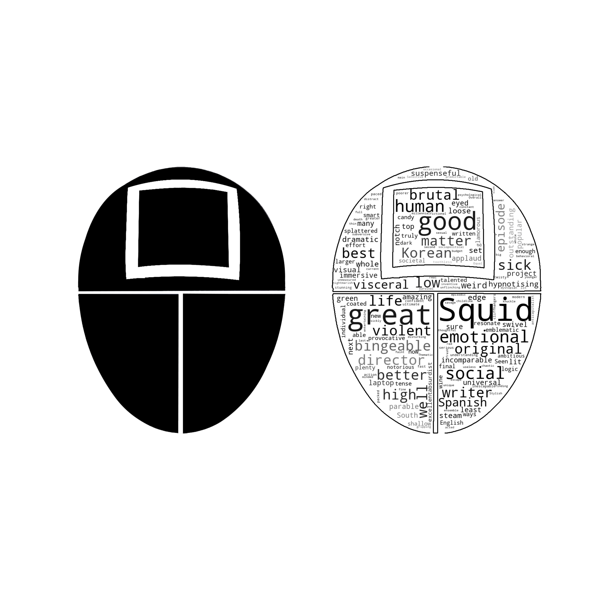
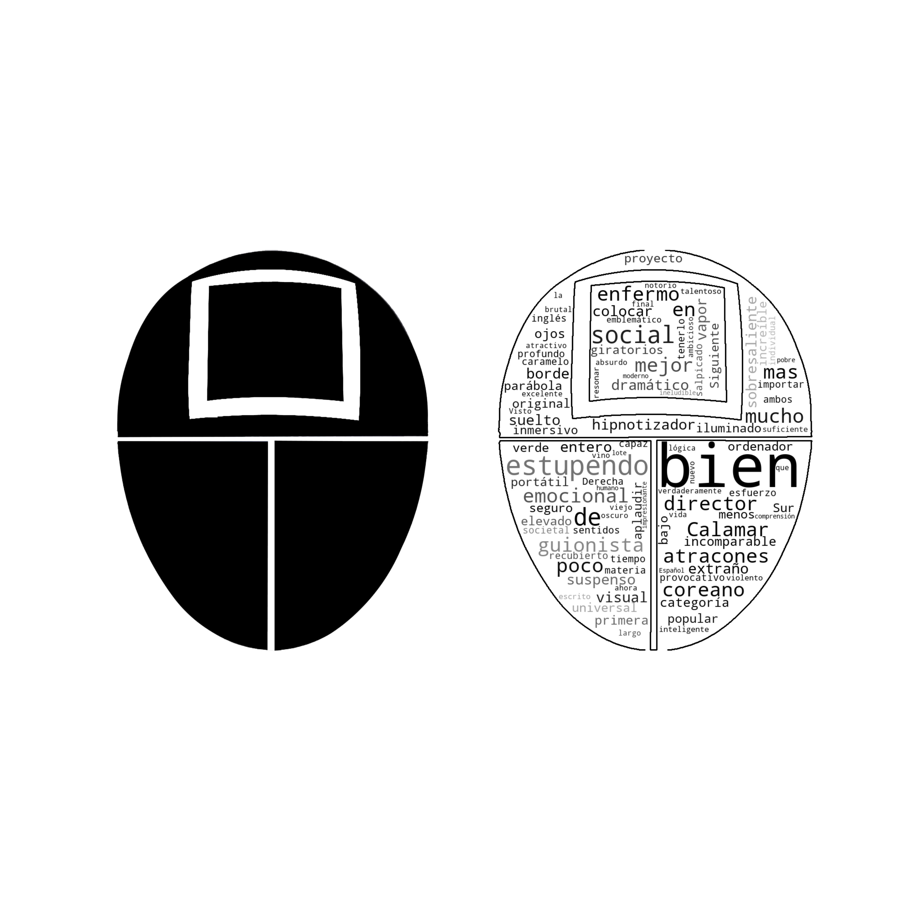
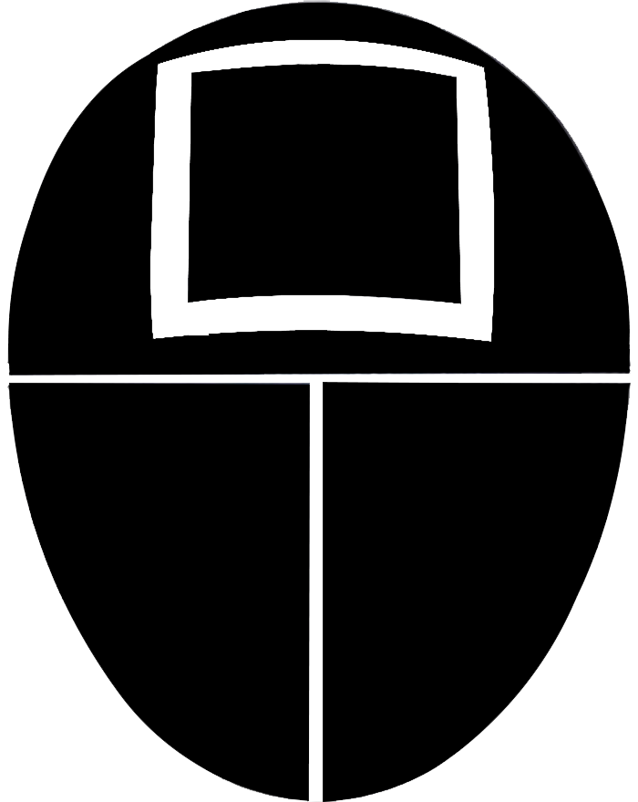

<h2 align="center">Squid Game | Season 1 | Rotten Tomatoes 🍅</h2>

Visualizando as críticas dos usuários do <a href="https://www.rottentomatoes.com/">Rotten Tomatoes</a> sobre a 1ª temporada de Squid Game, em uma nuvem de palavras.
&emsp;

Web Scrapping • <a href="http://amueller.github.io/word_cloud/index.html">Word Cloud</a> • Data Visualization • <a href="https://www.nltk.org/">NLTK </a> • <a href="https://py-googletrans.readthedocs.io/en/latest/#language-detection">Googletrans</a>
&emsp;

## Tecnologias e ferramentas utilizadas:

  
  

## Word Cloud | Inglês 

  <kbd>
    
  </kbd>

## Word Cloud | Português 

  <kbd>
    
  </kbd>

## Word Cloud | Espanhol 

  <kbd>
    
  </kbd>

## Máscara criada no Photoshop | Square Soldier

  <kbd>
    
    <h6 align="center"><i>By: Marina Eicardi</i></h6>
  </kbd>

